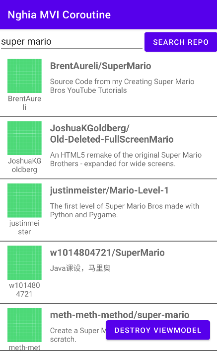

# android-mvi-coroutine-demo



## DI Flow diagram


```kotlin
// UI Layer request getRepoList
      @Composable
      fun RepoListScreen(
            viewModel: RepoListViewModel = hiltViewModel() // Yêu cầu ViewModel từ Hilt
      ) {
            // ... viewModel.getRepoList()
      }

// Hilt ViewModel for UI use
    @HiltViewModel
    class RepoListViewModel @Inject constructor(
        private val getRepoListUseCase: GetRepoListUseCase
    ) : ViewModel() { /* ... */ }

// Hilt provide UseCase (Domain Layer) for ViewModel using
    class GetRepoListUseCase @Inject constructor(
        private val repository: GithubUserRepository // Phụ thuộc vào interface
    ) { /* ... */ }
    
// Hilt Module to connect Interface with Implementation
    @Module
    @InstallIn(SingletonComponent::class)
    abstract class RepositoryModule {
        @Binds
        abstract fun bindGithubUserRepository(
            impl: GithubUserRepositoryImpl
        ): GithubUserRepository // Kết nối interface và implementation
    }

    interface GithubUserRepository {
      fun getUserDetail(username: String): Flow<DataState<GithubUser>>
      fun getRepoList(keyWork: String, page: Int, perPage: Int): Flow<DataState<List<GithubRepo>>>
    }
    
    class GithubUserRepositoryImpl @Inject constructor(
        private val context: Context,
        private val retrofit: Retrofit,
        private val githubWS: GithubWS,
        private val githubUserResponseMapper: GithubUserResponseMapper,
        private val githubRepoResponseMapper: GithubRepoResponseMapper
    ) : GithubUserRepository { /* ... */ }
    
```

